# BMS EATS 🍛🍝

At our college, we believe that good food is an essential part of an enriching campus life✨. We are thrilled to introduce our food booking website, specially crafted to elevate your dining experience and bring a world of flavors right to your fingertips. Whether you're a student,faculty member or a curious visitor, our platform is designed to cater to all.

 

## Introduction

With a diverse array of on-campus eateries and dining spots, our website is your gateway to exploring a world of flavors. From hearty comfort food to wholesome, health-conscious choices, we've curated an extensive menu lineup that caters to every palate. Embark on a culinary adventure with just a few clicks and let your taste buds revel in the delightful assortment of mouthwatering delicacies.

 

## Features
- Menu Exploration: Browse through a diverse range of menus offered by different on-campus eateries and dining spots. From mouthwatering delicacies to healthy meal options, our website presents a delightful selection to cater to all taste preferences.

- Online Ordering: Avoid long queues and save time with our user-friendly online ordering system. Simply select your desired items from the menu, customize your order if needed, and proceed to checkout – it's that easy!
  
- Convenience and Speed: Digital payment methods such as credit/debit cards, mobile wallets, and online banking enable users to make payments quickly and conveniently. By eliminating the need for cash transactions, students, faculty, and staff can complete their orders swiftly, even during peak dining hours. This expedites the entire process, reducing wait times and ensuring a hassle-free dining experience.

- Real-Time Updates: Stay informed with real-time updates on the status of your order. You'll receive notifications for order confirmation, preparation, and delivery, ensuring you know exactly when to pick up your freshly prepared meal.

- Exclusive Deals and Discounts: Our food booking website regularly offers exclusive deals and discounts for students and staff. Enjoy special offers and promotions on your favorite meals, making dining on campus even more affordable.
- Feedback:Share your valuable feedback on the food and service, helping us continually enhance your dining journey. Rate eateries, provide insights, and be an essential part of the food-loving community that shapes our culinary landscape.

 

## Technologies Used 
- Front end -HTML,CSS,JS
- Backend -PHP 

 

## Login Page

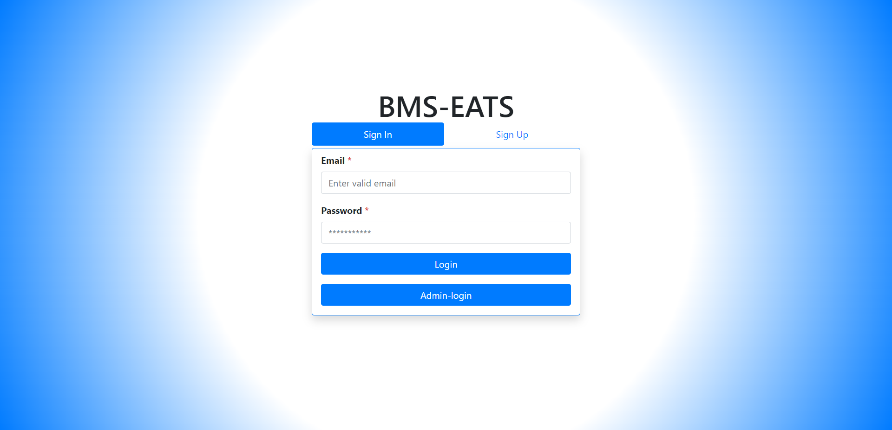

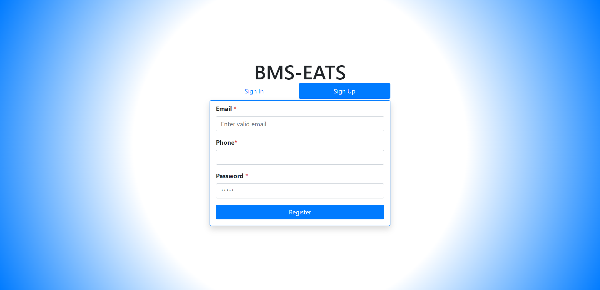

 

## Home Page

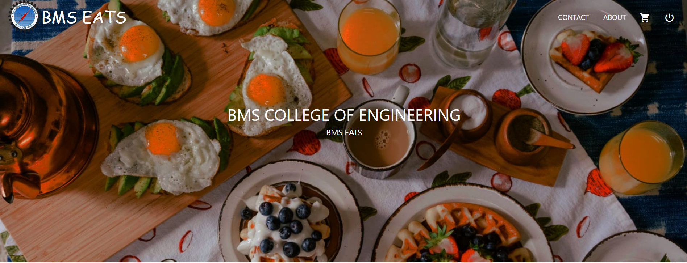

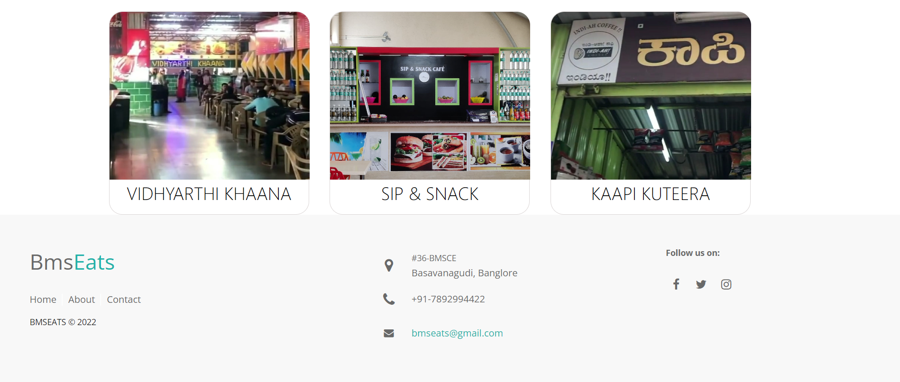

 

## About Page

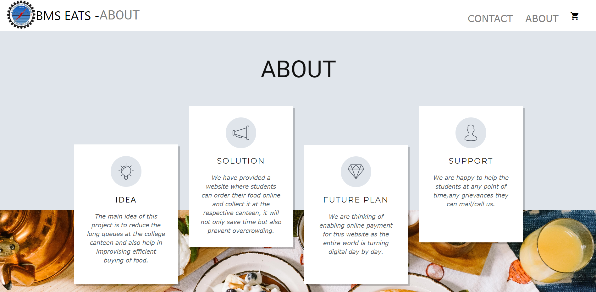

 

## Contact Us Page

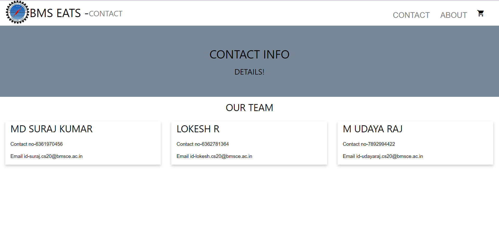

 

## Product List Page 

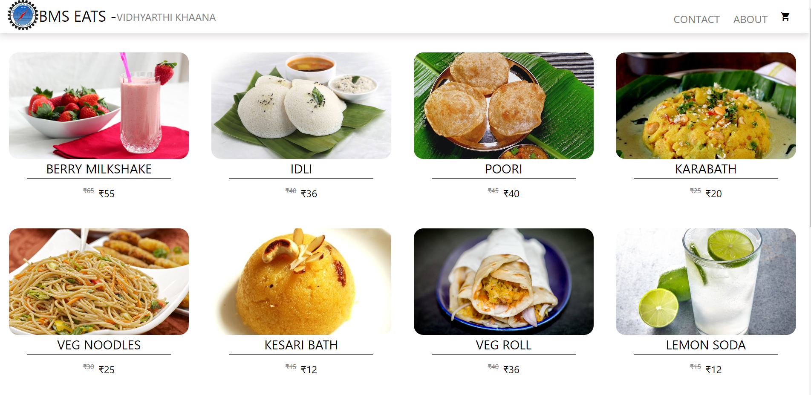

 

## Product Description Page 

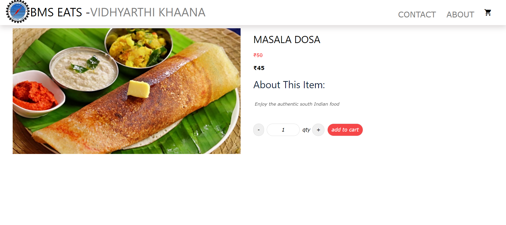

 

## Cart Page

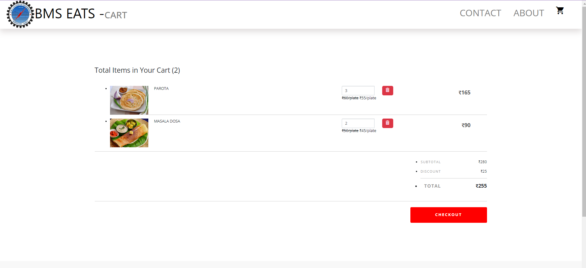

 

## Checkout Page

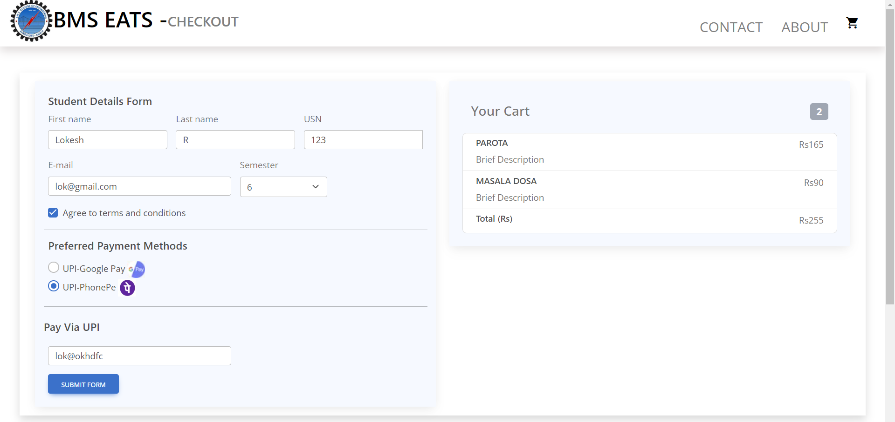

 

## Final Page

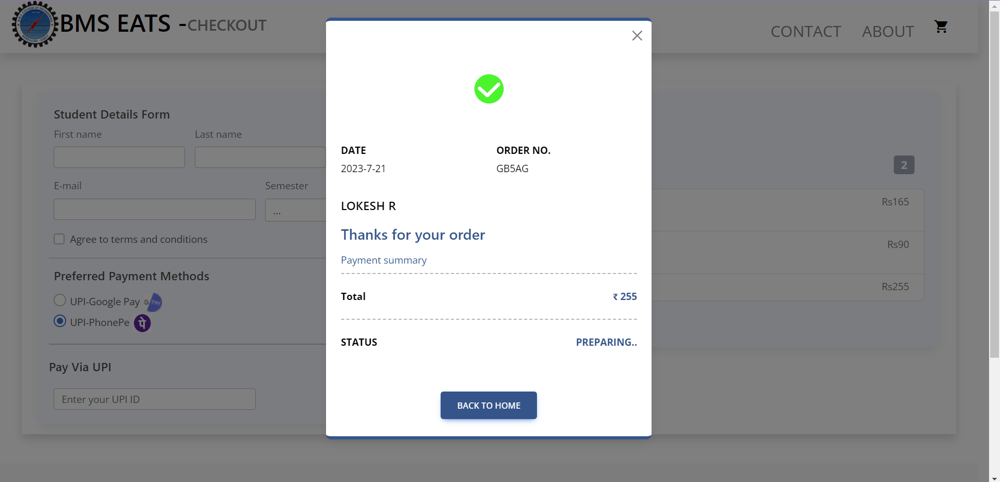

